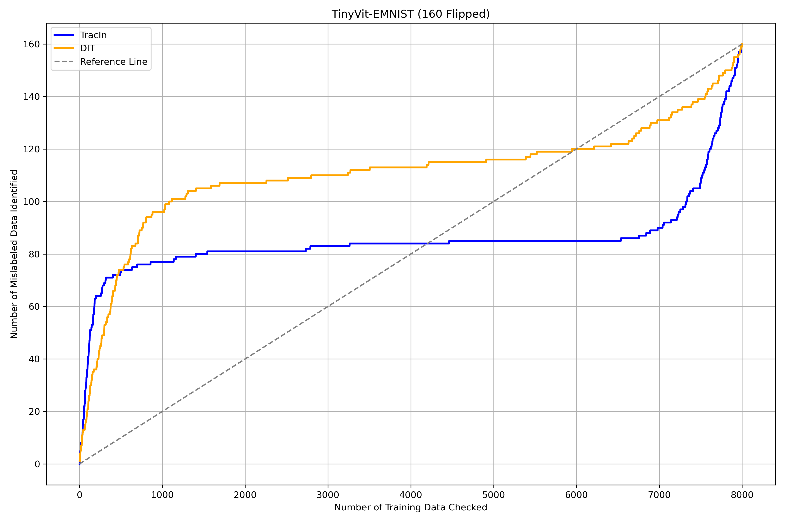
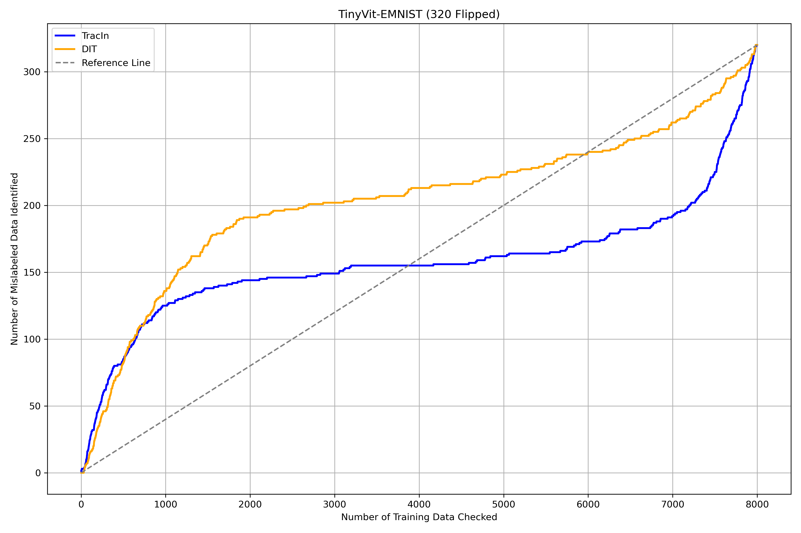
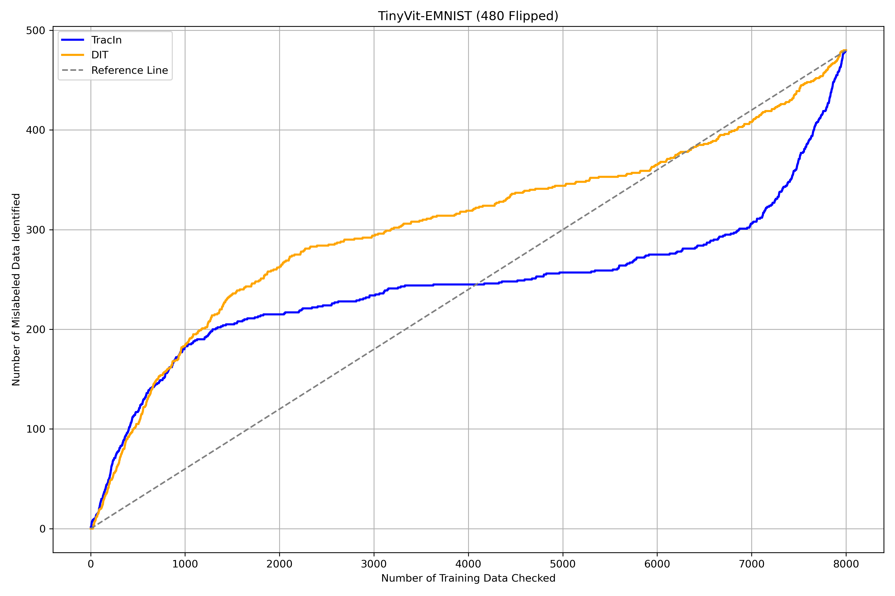
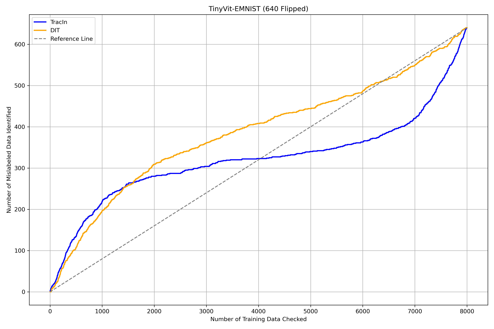
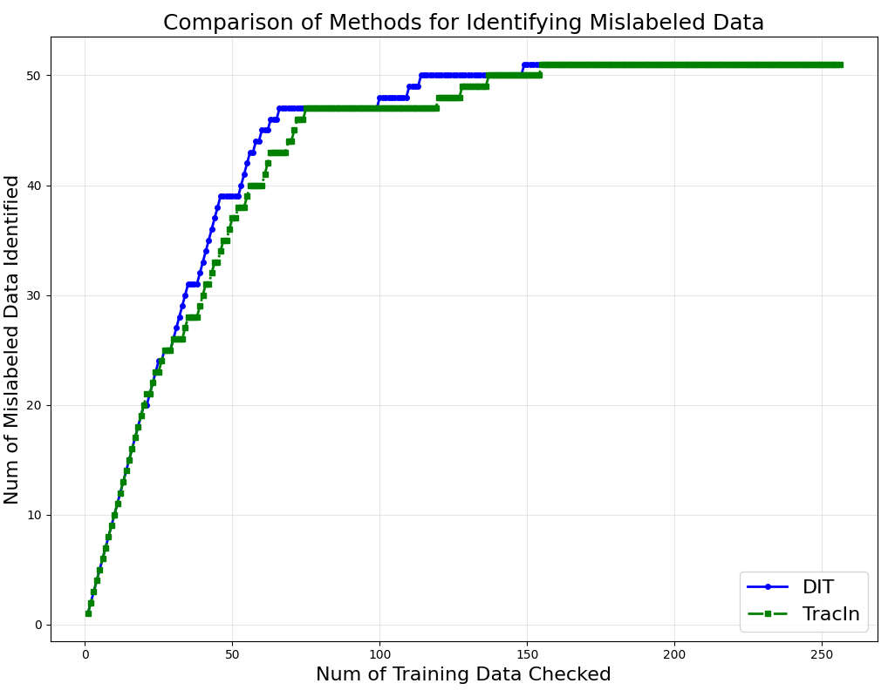
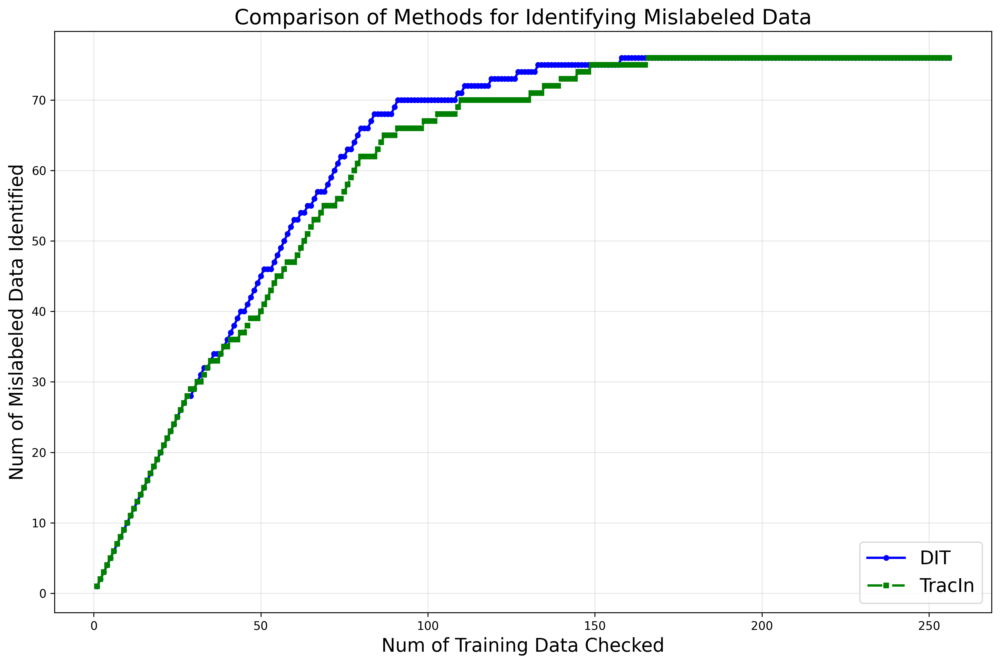

## [Updated on 8th April] DIT and TracIn Comparison for Label Flip Detection

We compared the performance of DIT and TracIn methods for detecting flipped labels. Results are shown in the following figures:

- **Figure 1: Comparison of DIT vs TracIn for Label Flip Detection with 2% Flipped Labels on EMNIST Dataset with TinyViT Model**

- **Figure 2: Comparison of DIT vs TracIn for Label Flip Detection with 4% Flipped Labels on EMNIST Dataset with TinyViT Model**

- **Figure 3: Comparison of DIT vs TracIn for Label Flip Detection with 6% Flipped Labels on EMNIST Dataset with TinyViT Model**

- **Figure 4: Comparison of DIT vs TracIn for Label Flip Detection with 8% Flipped Labels on EMNIST Dataset with TinyViT Model**

- **Figure 5: Comparison of DIT vs TracIn for Label Flip Detection with 20% Flipped Labels on MNIST Dataset with DNN Model**

- **Figure 6: Comparison of DIT vs TracIn for Label Flip Detection with 30% Flipped Labels on MNIST Dataset with DNN Model**


# Dynamic Influence Tracker (DIT)

**Dynamic Influence Tracker (DIT)** is a project designed to track and analyze dynamic influences in various datasets using neural networks and machine learning techniques. This repository contains the necessary code, configurations, and data to run experiments related to influence tracking, particularly using the Adult dataset.

## Table of Contents

- [DIT and TracIn Comparison for Label Flip Detection](#dit-and-tracin-comparison-for-label-flip-detection)
- [Installation](#installation)
- [Project Structure](#project-structure)
- [Usage](#usage)
- [Configuration](#configuration)
- [Training and Testing](#training-and-testing)
- [License](#license)

## Installation

Before running the project, make sure you have Python installed on your machine. Follow the steps below to set up the environment:

1. Clone the repository:

    ```bash
    git clone https://github.com/dynamic-infl-tracker/DIT.git
    cd DIT
    ```

2. Set up the Python environment and install the required dependencies:

    ```bash
    sh setup_environment.sh
    ```

   This script will create a virtual environment and install all the necessary dependencies using miniconda.

## Project Structure

- `experiment/`
  - `DataModule.py`: Handles data preprocessing, loading, and management.
  - `NetworkModule.py`: Defines the neural network models used for influence tracking.
  - `config.py`: Configuration file for managing various hyperparameters and settings.
  - `data/`: Contains datasets used for the experiment, including the `adult-training.csv` and `adult-test.csv` files.
  - `data_cleansing.py`: Module for cleaning and preprocessing raw data.
  - `infl.py`: Core logic for influence tracking and analysis.
  - `logging_utils.py`: Utilities for logging experiment results and tracking progress.
  - `test_data_modules.py`: Unit tests for the `DataModule`.
  - `train.py`: Main script for training the model on the dataset.

- `setup_environment.sh`: Script for setting up the Python environment and installing dependencies.
- `slurm_job.sh`: Script for running the experiment on a Slurm-based cluster.

## Usage

1. To run the training script, use the following command:

    ```bash
    python experiment/train.py --target mnist --model dnn
    ```

   This will start training the model using the data specified in the `config.py` file.

2. To modify the dataset or other configurations (e.g., batch size, learning rate, number of epochs), you can edit the `config.py` file before running the training.

### Additional Commands

- **Influence Measurement using DIT method**:

    ```bash
    python experiment/Sec71/infl.py --target mnist --model dnn --type dit
    ```

   This command runs influence tracking using the DIT method on the MNIST dataset with a DNN model.

- **Label Flipping Experiment**:
  - For training with flipped labels:

      ```bash
      python experiment/train.py --target mnist --model dnn --flip 20
      ```

      This command flips 20% of the labels in the dataset during training.

  - To measure the influence after label flipping:

      ```bash
      python experiment/Sec71/infl.py --target mnist --model dnn --type dit --flip 20
      ```

      This command runs influence measurement on the MNIST dataset with 20% of the labels flipped.

- **Slurm-based Cluster Execution**:
    The `slurm_job.sh` script provides an example of how to run the experiment on an HPC system with a Slurm workload manager.

## Configuration

All the configurations are located in `experiment/config.py`. Key parameters include:

- `DATA_PATH`: Path to the dataset.
- `BATCH_SIZE`: Batch size used during training.
- `LEARNING_RATE`: Learning rate for the optimizer.
- `EPOCHS`: Number of training epochs.

You can adjust these parameters according to your needs.

## Training and Testing

- **Training**: To train the model, run the `train.py` script. The model will be trained using the specified dataset and configuration.
- **Testing**: After training, the script will evaluate the model's performance on the test dataset, located in `experiment/data/adult-test.csv`.

## License

This project is licensed under the MIT License. See the [LICENSE](LICENSE) file for more details.
